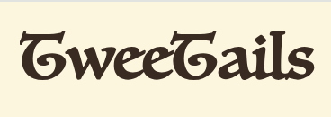

# TweeTails 🐾

Welcome to TweeTails, where **every tweet helps a tail**! This web application is your go-to platform for sharing and discovering reports on injured animals or those in need of attention. Whether you're an animal lover, a concerned citizen, or a wildlife warrior, TweeTails makes it easy and fun to contribute to animal welfare in your community.

## What is TweeTails?

TweeTails is an application designed to bridge the gap between animals in distress and the people who can help them. Users can post details about animals they encounter who appear to be injured, lost, or in need of help, complete with location tags and photos. Other users can view these posts, offer assistance, or alert local rescue organizations.

## Features

- **Post Reports:** Share real-time updates about animals in need, with options to upload images and specify locations.
- **View Reports:** Browse through a list of reported cases, filterable by location, urgency, and type of animal.
- **User Profiles:** Create and customize your profile to track your posts and the animals you've helped.

## Getting Started
**[🐾🐾🐾 Click me to visit TweeTails!🐾🐾🐾](https://tweetails.onrender.com/)**
